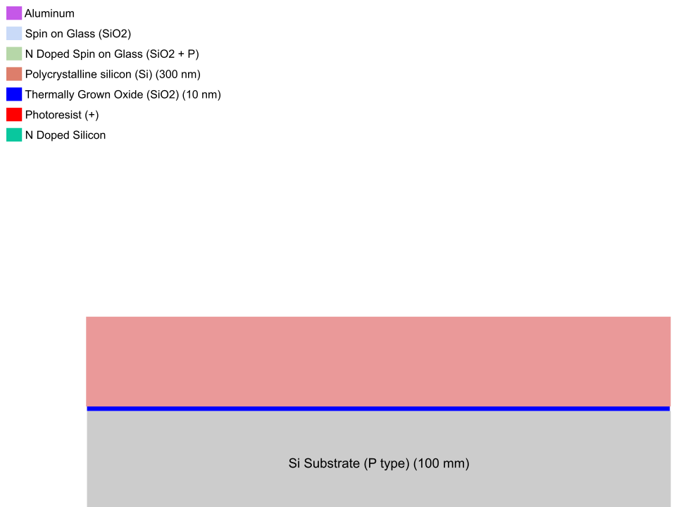
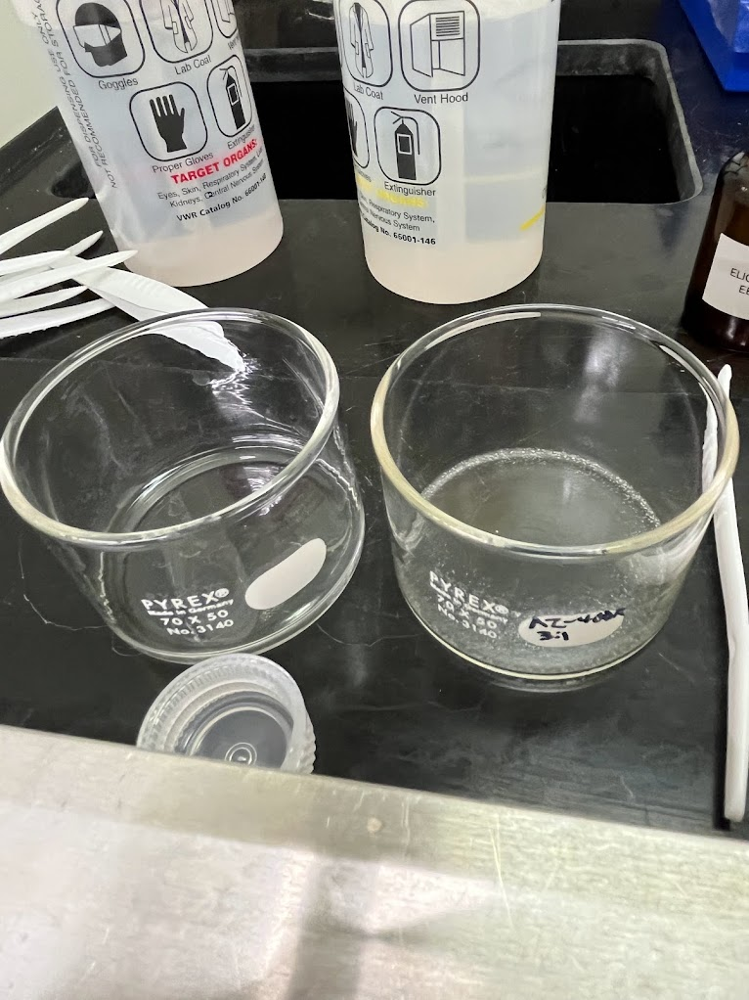
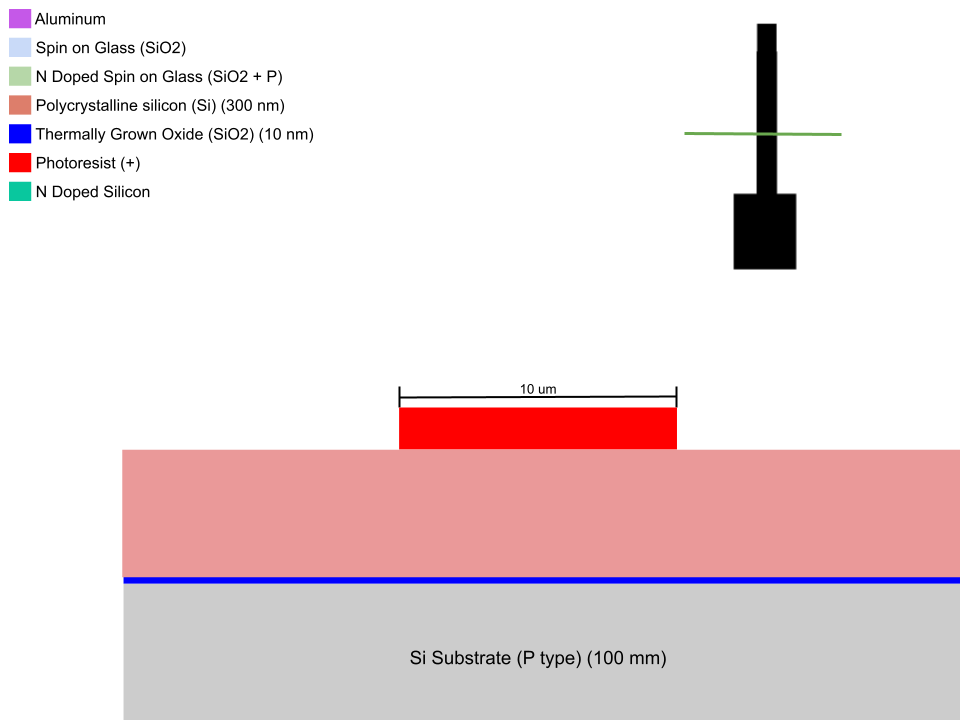
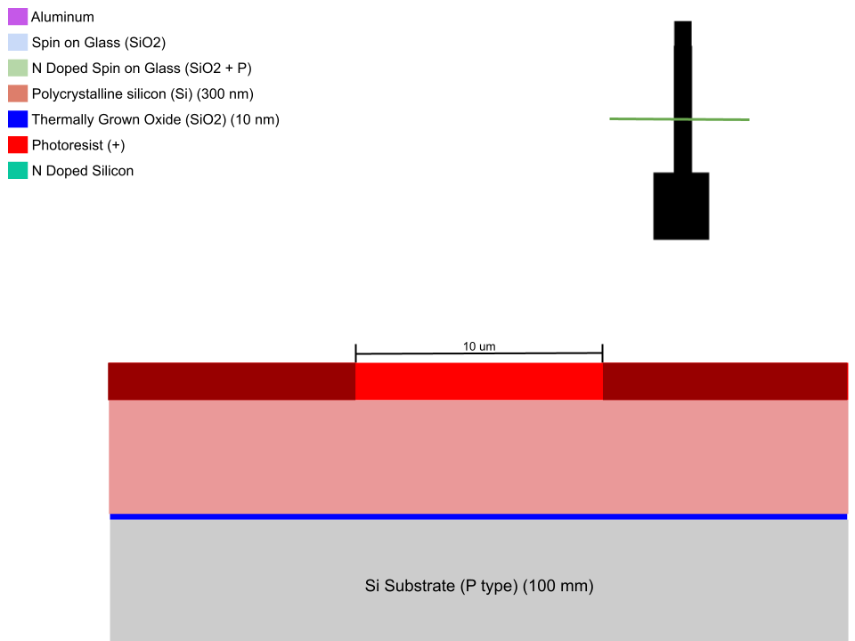
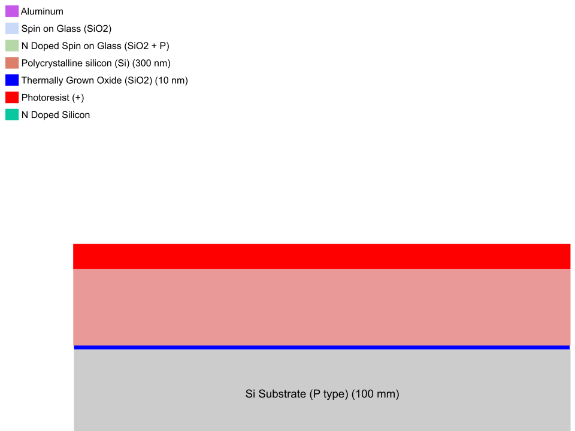

<!-- Copy and paste the converted output. -->

<!-----

You have some errors, warnings, or alerts. If you are using reckless mode, turn it off to see inline alerts.
* ERRORs: 0
* WARNINGs: 0
* ALERTS: 5

Conversion time: 1.757 seconds.


Using this Markdown file:

1. Paste this output into your source file.
2. See the notes and action items below regarding this conversion run.
3. Check the rendered output (headings, lists, code blocks, tables) for proper
   formatting and use a linkchecker before you publish this page.

Conversion notes:

* Docs to Markdown version 1.0β34
* Sun May 07 2023 04:17:16 GMT-0700 (PDT)
* Source doc: Patterning Manual
* Tables are currently converted to HTML tables.
* This document has images: check for >>>>>  gd2md-html alert:  inline image link in generated source and store images to your server. NOTE: Images in exported zip file from Google Docs may not appear in  the same order as they do in your doc. Please check the images!


WARNING:
You have 5 H1 headings. You may want to use the "H1 -> H2" option to demote all headings by one level.

----->


<p style="color: red; font-weight: bold">>>>>>  gd2md-html alert:  ERRORs: 0; WARNINGs: 1; ALERTS: 5.</p>
<ul style="color: red; font-weight: bold"><li>See top comment block for details on ERRORs and WARNINGs. <li>In the converted Markdown or HTML, search for inline alerts that start with >>>>>  gd2md-html alert:  for specific instances that need correction.</ul>

<p style="color: red; font-weight: bold">Links to alert messages:</p><a href="#gdcalert1">alert1</a>
<a href="#gdcalert2">alert2</a>
<a href="#gdcalert3">alert3</a>
<a href="#gdcalert4">alert4</a>
<a href="#gdcalert5">alert5</a>

<p style="color: red; font-weight: bold">>>>>> PLEASE check and correct alert issues and delete this message and the inline alerts.<hr></p>


```
Patterning Manual
```


<table>
  <tr>
   <td>Photoresist Thickness
   </td>
   <td>2 µm
   </td>
  </tr>
  <tr>
   <td>Total Time 
   </td>
   <td>20 minutes
   </td>
  </tr>
  <tr>
   <td>Minimum line size
   </td>
   <td>10 µm
   </td>
  </tr>
  <tr>
   <td>Alignment tolerance
   </td>
   <td>10 µm
   </td>
  </tr>
</table>


<p id="gdcalert1" ><span style="color: red; font-weight: bold">>>>>>  gd2md-html alert: inline image link here (to images/image1.png). Store image on your image server and adjust path/filename/extension if necessary. </span><br>(<a href="#">Back to top</a>)(<a href="#gdcalert2">Next alert</a>)<br><span style="color: red; font-weight: bold">>>>>> </span></p>





          	Substrate (varies) 				    Spin Coat


<p id="gdcalert2" ><span style="color: red; font-weight: bold">>>>>>  gd2md-html alert: inline image link here (to images/image2.png). Store image on your image server and adjust path/filename/extension if necessary. </span><br>(<a href="#">Back to top</a>)(<a href="#gdcalert3">Next alert</a>)<br><span style="color: red; font-weight: bold">>>>>> </span></p>





            Expose						Develop


<p id="gdcalert3" ><span style="color: red; font-weight: bold">>>>>>  gd2md-html alert: inline image link here (to images/image3.png). Store image on your image server and adjust path/filename/extension if necessary. </span><br>(<a href="#">Back to top</a>)(<a href="#gdcalert4">Next alert</a>)<br><span style="color: red; font-weight: bold">>>>>> </span></p>



  

<p id="gdcalert4" ><span style="color: red; font-weight: bold">>>>>>  gd2md-html alert: inline image link here (to images/image4.png). Store image on your image server and adjust path/filename/extension if necessary. </span><br>(<a href="#">Back to top</a>)(<a href="#gdcalert5">Next alert</a>)<br><span style="color: red; font-weight: bold">>>>>> </span></p>





		     						


# Tools


1. [Spin Coater](https://docs.google.com/document/d/16tg5COz3QADQcWTJfgbuTBRsJrYIF2IFitKL2VLnr3I/edit?usp=sharing)
2. [Hot Plate](https://docs.google.com/document/d/14IZRb_CLO6zwDDNvO9dSkzYD5jisfbr-6na2exCk-T0/edit?usp=sharing)
3. Flashlight Jig or Maskless Lithography Stepper


# Materials


1. [Hexamethyldisilazane (HMDS) adhesion promoter](https://docs.google.com/document/d/1Wtk8l1dXzwlhdUSQaCBSIJ00-sB0tanP0AOklIOY0Ik/edit?usp=sharing)
2. AZ-4210 positive photoresist
3. AZ-400K Developer
4. Acetone
5. Isopropanol
6. Deionized water
7. Evaporating dish


# Procedure


## Preparation


1. Open [this spreadsheet](https://docs.google.com/spreadsheets/d/1T9-kXXxdD9c6KZh_iy1LGt8I8wGlmeVlIZmvBrkVQ2g/edit?usp=sharing) and record all values and results. Also record any steps that went wrong and how they went wrong. 
2. [Cleave](https://docs.google.com/document/d/1UWZ_X2TpRqdOWOC8YGubfD7xW-dz4nRNzJk5c_mo4w0/edit?usp=sharing) the Si wafer into a ~1 cm x 1 cm square.
3. Dust off the wafer with the nitrogen gun

Wafer Cleaning


1. In the fume hood, hold the wafer with tweezers over the sink.
2. Rinse the polished side of the wafer thoroughly with acetone, then isopropyl alcohol.
    1. The acetone leaves a residue that must be removed by the isopropyl alcohol rinse.
3. Blow the wafer dry with the nitrogen gun.
    2. Even when the wafer appears dry, there may still be moisture on the edges, so dry liberally.
4. Inspect with the naked eye and note any marks on the wafer.
    3. Marks present after cleaning are likely scratches that need to be documented so we observe their effect on the process.


## Spin Coat


4. If previous steps required cleaning with solvents, pre-bake the wafer to dehydrate the surface.
5. If patterning on silicon, spin coat 1 drop of HMDS. Otherwise skip to 7. 
    1. Choose Time and RPM from [patterning data sheet](https://docs.google.com/spreadsheets/d/1T9-kXXxdD9c6KZh_iy1LGt8I8wGlmeVlIZmvBrkVQ2g/edit#gid=0)
6. Bake on the hot plate at 100°C for 30 seconds.
7. Spin coat as much photoresist as needed to mostly cover the chip, normally 2-3 drops
    2. Choose Time and RPM from [patterning data sheet](https://docs.google.com/spreadsheets/d/1T9-kXXxdD9c6KZh_iy1LGt8I8wGlmeVlIZmvBrkVQ2g/edit#gid=0)
8. Soft bake on the hot plate at 100°C for 90 seconds.


## Expose Using Maskless Photolithography Stepper


1. Turn on the projector. Plug in the HDMI cable for the projector and the USB camera cable.
2. Set up the projector as a second screen on your computer’s  display settings.
3. Put your image to be patterned in a Google Slides presentation. Example: [patterning](https://docs.google.com/presentation/d/16H1Pf2Zkq9nyL4HAj6gduJSA1r-k2tIijDcd4yQjXhY/edit#slide=id.p). 
    1. Put a black screen as the last slide in your presentation. This will be the non-exposing/”off” slide.
    2. Put another black screen as the second to last slide, this time adding a dark gray plus sign or other easily focusable feature. Ensure this feature is in an area that will either get exposed or isn’t used.
4. Copy the flat field correction mask from here and paste it on top of your pattern in google slides. Select the mask and go to format options > set opacity to 50%.
5. Check that the red filter is inserted and the bandpass (UV) filter is out.
6. Place the chip with soft baked photoresist on the stage.
7. Open AmScope, find your chip, focus and align. The plus sign grid pattern is useful for accurate focus.
8. Switch to the black screen after your pattern in the presentation.
9. Move the Z stage by 7 ticks counter clockwise. This will switch from focusing in red to focusing in UV.
10. Turn the exposure time to ~130ms and the gain all the way up on AmScope.
11. Use an opaque, flat object to block the light coming out of the objective while you remove the red filter and insert the UV filter.
12. Press the left arrow key once to switch to the focus pattern. Use the Z axis to focus. Try to do this as quickly as possible to avoid unnecessary exposure.
13. Expose your pattern for 4 seconds: press the left arrow key to switch to your pattern in the presentation. Switch back to the black screen when the timer elapses. Try to be precise.
14. Move on to your next pattern and repeat. If you’re aligning with an underlying pattern you need to switch back to red. Otherwise you can try stepping over and exposing in UV without refocusing.


## Develop


<p id="gdcalert5" ><span style="color: red; font-weight: bold">>>>>>  gd2md-html alert: inline image link here (to images/image5.png). Store image on your image server and adjust path/filename/extension if necessary. </span><br>(<a href="#">Back to top</a>)(<a href="#gdcalert6">Next alert</a>)<br><span style="color: red; font-weight: bold">>>>>> </span></p>





9. Rinse the evaporating dish if needed.
    3. Simply use the left-most tap on the sink in the fume hood at a low pressure to lightly wash the dish
10. Pour about 30 mL of **pre-diluted** 3:1 AZ-400K developer solution into the evaporating dish labeled “AZ-400L 3:1”.
11. Fill another evaporating dish halfway with DI water.
12. Start the timer at the same time as you drop the wafer into the developer, photoresist side up.
13. Agitate the chip in the developer solution with quick, small circular motions. Watch [this video](https://drive.google.com/file/d/1C2APhZpUS7O2a-3hzmjMloyEuc7RCg1Z/view?usp=sharing) for proper technique.
14. **5 seconds before the end of the timer, pick up the chip and prepare to drop it into the water. The chip should hit the water exactly at 0 seconds.**
    4. Note that development time includes all the time that developer is touching the chip, not just during agitation
15. Dry off the chip with compressed air and/or blot it on a wipe.


## Inspect


16. Look at the chip with your bare eyes to help build an intuition for the process.
17. Put the chip under the microscope. Connect to the camera with your laptop and take pictures at 5X, 10X bright and dark field, 20X bright and dark field, and 50X.
18. Batch save then upload the folder to [Patterning Photos](https://drive.google.com/drive/folders/1-ON8-167CTyXiuhVdlI1_WMpKkx0M0a8?usp=share_link).
19. Paste a link to the folder in the last column of the patterning data sheet.
20. Put the chip away in a plastic box and label it with a serial number.


# Safety


1. 
HMDS is a toxic, volatile chemical that  should only be used in the fume hood.


2. 
Photoresist, while not as bad as HMDS, contains some nasty solvents and should be cleaned with acetone if it gets on anything other than chips and the spin coater.


3. 
AZ-400K developer is a strong base containing KOH. Use the appropriate precautions for working with bases.

---


# Appendix


## Alternative Exposure Technique: 365nm Flashlight


21. Put on UV protection glasses.
22. Before placing the chip under the exposure area, turn on the flashlight and adjust the position of the UV meter’s sensor head to maximize the reading. 
    5. Depending on the battery level, this should be around 10 mW/cm<sup>2</sup>.
23. Turn off the flashlight, being careful not to move it out of position.
24. Place the chip on the plastic cap photoresist side up. 
25. Place the mask on the wafer. Gently press down to sandwich the two together.
    6. If the ThorLabs logo is correctly oriented then the chrome is facing you. Put that side face down towards the chip.
    7. Try not to slide the mask on the wafer because you’ll damage the photoresist.
26. Place the cap with the wafer and mask on top of the UV sensor.
27. Turn on the flashlight for the desired exposure time.
28. Record the measured exposure time in the [spreadsheet](https://docs.google.com/spreadsheets/d/1T9-kXXxdD9c6KZh_iy1LGt8I8wGlmeVlIZmvBrkVQ2g/edit?usp=sharing)
    8. Does should be automatically calculated in the sheet based on exposure option used